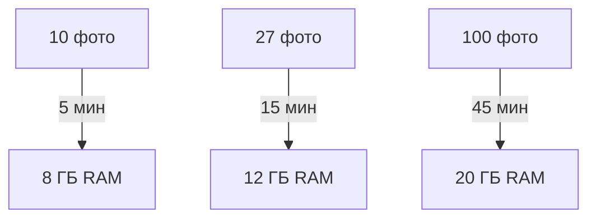

<div align="center">

# BC-26 🏗️

<div align="center">
  
[](https://github.com/nikitosrus01/BC-26)
[](https://github.com/nikitosrus01/BC-26)
[](https://github.com/nikitosrus01/BC-26/issues)
[](https://github.com/nikitosrus01/BC-26/blob/main/LICENSE)

<br>


</div>

## 🚀 Быстрый старт (2 минуты)

```bash
# 1. Установка
pip install -r requirements.txt

# 2. Тест фотограмметрии
mkdir test_folder && echo "тестовые фото" > test_folder/test.jpg
metashape_ortho.py test_folder output.jpg

# 3. Запуск
python app.py
```

🌐 **http://localhost:5000** — готово!

## ✨ Что делает BC-26

| Этап | Инструмент | Результат |
|------|------------|-----------|
| 1. Фотограмметрия | Metashape 2.2.2 Pro | Ортомозаика 0.02м/пикс |
| 2. Детекция | YOLOv8 | Трещины + координаты |
| 3. Экспорт | JPG + JSON | Готовые данные |

**Время: 5-45 мин | RAM: 8-20 ГБ**

## 📱 Демо

<div align="center">


</div>

## 🛠 Требования

| Компонент | Версия | Примечание |
|-----------|--------|------------|
| **Metashape** | Pro 2.2.2 | Лицензия обязательна |
| **Python** | 3.8+ | pip install -r requirements.txt |
| **YOLO** | v8n | best.pt в корне |
| **GPU** | Intel Arc+ | CUDA не требуется |

## 📂 Структура
BC-26/
├── app.py # Flask + YOLO
├── metashape_ortho.py # Фотограмметрия
├── best.pt # Модель трещин
├── requirements.txt # Зависимости
├── templates/index.html # UI
└── README.md # Вы читаете

text

## ⚙️ Конфигурация

```python
# app.py
RESIZE_TO = 4000           # Размер орто
CONFIDENCE = 0.25          # Порог YOLO
RESOLUTION = 0.02          # м/пиксель
```

## 🚀 Производительность



## 🔧 Частые проблемы

| ❌ Ошибка | ✅ Решение |
|----------|------------|
| Folder not found | `mkdir test_folder` + JPG |
| Metashape license | Pro версия + лицензия |
| CUDA memory | `RESIZE_TO=2000` |
| np not defined | `pip install numpy` |

## 📈 Результаты

**Вход**: ZIP с 27 фото → **Выход**:
output.jpg # Ортомозаика
annotated.jpg # + разметка трещин
defects.json # Координаты + confidence

text

## 👥 Автор

**Никита Голубицкий**  
[nikitosrus01@github](https://github.com/nikitosrus01)  
Челябинск, 2026

## 📄 Лицензия

[](LICENSE)

<div align="center">

**⭐ Star если помогло**  
**🐛 Issues для багов**  
**💬 Discussions для вопросов**

</div>