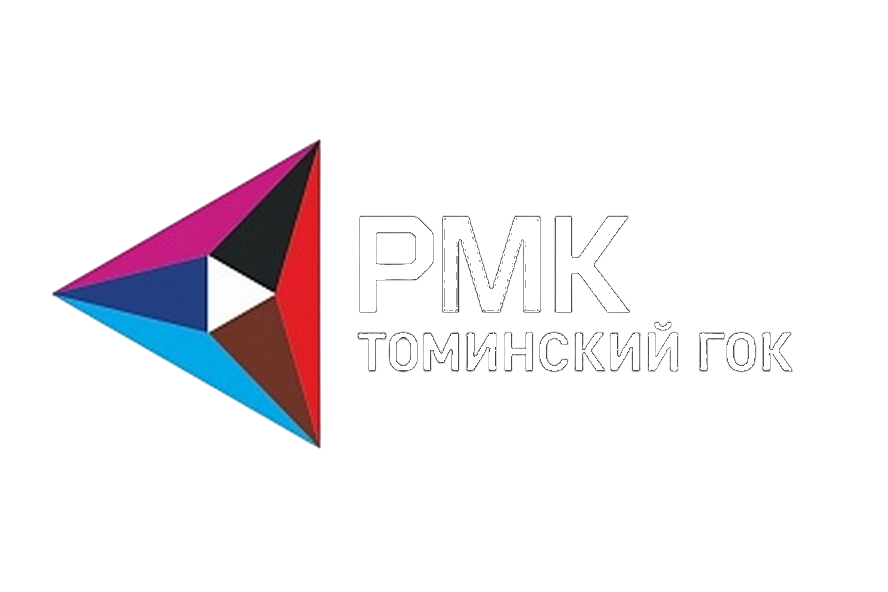
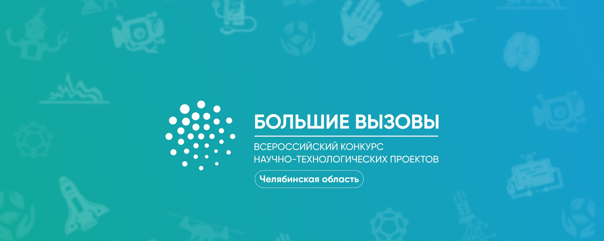
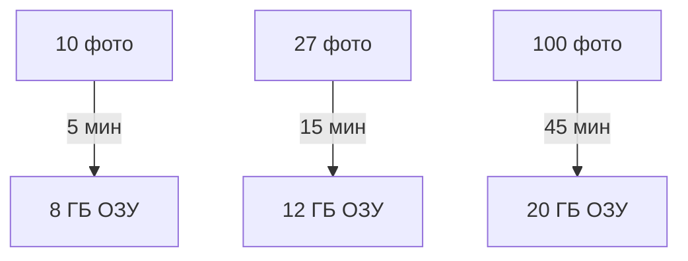

<div align="left">

# Большие вызовы 2026 

<div align="center">
  
[](https://github.com/nikitosrus01/BC-26)
[](https://github.com/nikitosrus01/BC-26)
[](https://github.com/nikitosrus01/BC-26/issues)
[](https://github.com/nikitosrus01/BC-26/blob/main/LICENSE)

<br>



<br>

[](https://www.python.org/)
[](https://flask.palletsprojects.com/)
[](https://www.agisoft.com/)
[](https://ultralytics.com/)

</div>

<div align="left">

## 🚀 Быстрый старт (2 минуты)

```bash
# 1. Установка
pip install -r requirements.txt

# 2. Тест фотограмметрии
mkdir test_folder
# Положите 3+ JPG/PNG в test_folder
"C:\Program Files\Agisoft\Metashape Pro\metashape.exe" -r metashape_ortho.py test_folder output.jpg
# Ожидаемый: SUCCESS: output.jpg

# 3. Запуск сервера
python app.py
```

🌐 **http://localhost:5000** — готово!

---

<div align="center">

## ✨ Возможности

| Этап | Инструмент | Результат |
|------|------------|-----------|
| **1. Фотограмметрия** | Metashape 2.2.2 Pro | Ортомозаика 0.02м/пикс |
| **2. Детекция дефектов** | YOLOv8 | Трещины + координаты |
| **3. Экспорт** | JPG + JSON | Готовые данные |

**Время: 5-45 мин | ОЗУ: 8-20 ГБ**

</div>

<div align="center">

## 📱 Демо


</div>

<div align="center">

## 🛠 Требования

| Компонент | Версия | Примечание |
|-----------|--------|------------|
| **Metashape** | Pro 2.2.2 | Лицензия обязательна |
| **Python** | 3.8+ | `pip install -r requirements.txt` |
| **YOLO** | v8n | `best.pt` в корне |
| **GPU** | Intel Arc+ | CUDA необязательно |

</div>

<div align="center">

## 🚀 Производительность



</div>

<div align="center">

## 🔧 Частые проблемы

| ❌ Ошибка | ✅ Решение |
|----------|------------|
| `Folder not found` | `mkdir test_folder` + JPG |
| `License error` | Лицензия Metashape Pro |
| `CUDA out of memory` | `RESIZE_TO=2000` |
| `NameError: np` | `pip install numpy` |

</div>

---

## 📂 Структура проекта
```
BC-26/
├── app.py # Flask бэкенд + YOLO
├── metashape_ortho.py # Фотограмметрия Metashape
├── best.pt # Модель трещин
├── requirements.txt # Зависимости
├── templates/index.html # Веб-интерфейс
├── static/ # CSS/JS
└── test_folder/ # Тестовые фото
```


## ⚙️ Конфигурация

### app.py
```python
MODEL_PATH = "best.pt"              # Путь к YOLO
RESIZE_TO = 4000                    # Макс размер (пиксели)
ORTHOPHOTO_RESOLUTION = 0.02        # Разрешение (м/пикс)
CONFIDENCE = 0.25                   # Порог детекции
```

### metashape_ortho.py
downscale=2 # Среднее качество
HighAccuracy # Точное выравнивание
MildFiltering # Сглаживание шума
MosaicBlending # Смешивание текстур


## Использование

1. **Загрузите ZIP** с фото дрона (до 2 ГБ)
2. **Дождитесь** обработки (5-45 минут)
3. **Скачайте**:
   - `output.jpg` — ортомозаика
   - `annotated.jpg` — с разметкой трещин
   - `defects.json` — координаты дефектов

## API
POST /upload # ZIP + обработка
GET /health # Статус системы


## 📈 Результаты

**Вход**: ZIP с 27 фото  
**Выход**:
output.jpg # Ортомозаика
annotated.jpg # + Разметка трещин
defects.json # Координаты + confidence


## 👥 Автор

**Никита Голубицкий**  
[nikitosrus01@github](https://github.com/nikitosrus01)  
Челябинск, 2026

<div align="center">

## 📄 Лицензия

[](LICENSE)


**⭐ Поставьте звезду**  
**🐛 Баги → Issues**  
**💬 Вопросы → Discussions**

</div>