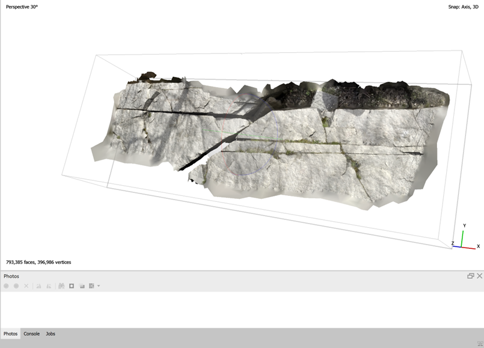
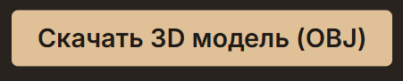

<div align="left">

# Большие вызовы 2026 


<div>

<div align="center">

**v2.2** • Обновлено **26.03.2026**  
Добавлена возможность скачивания 3D-модели в формате OBJ прямо из веб-сервиса

[](https://github.com/nikitosrus01/BC-26)
[](https://github.com/nikitosrus01/BC-26)
[](https://github.com/nikitosrus01/BC-26/issues)
[](https://github.com/nikitosrus01/BC-26/blob/main/LICENSE)

<br>


<br>

[](https://www.python.org/)
[](https://flask.palletsprojects.com/)
[](https://www.agisoft.com/)
[](https://ultralytics.com/)

</div>

## Что нового в v2.2

Добавлена возможность скачать готовую 3D-модель карьера в формате OBJ прямо из веб-интерфейса. Теперь весь процесс — от загрузки снимков до получения модели — можно выполнить в одном месте.

<div align="center">

**Результат: 3D-модель карьера**  


**Кнопка скачивания в интерфейсе**  


</div>

---

## О проекте

Проект посвящён автоматизации мониторинга карьерной местности с использованием беспилотника и методов компьютерного зрения.

Система объединяет несколько этапов:
- построение ортофотоплана по аэрофотоснимкам,
- анализ изображений с помощью нейросети,
- выявление трещин и других потенциально опасных дефектов.

Проект был разработан в рамках конкурса «Большие вызовы» (2026) и вызвал интерес у Томинского горно-обогатительного комбината.

Основная цель — упростить и ускорить геотехнический мониторинг, а также снизить риски для специалистов.

---

## Основные возможности

- Построение ортофотоплана из набора снимков (Agisoft Metashape)
- Автоматическое обнаружение трещин с помощью YOLO
- Веб-интерфейс для работы с данными
- Экспорт результатов:
  - изображения (JPG)
  - 3D-модель (OBJ)

---

## Работа веб-сервиса

<div align="center">

Полный процесс обработки: снимки → ортофотоплан → анализ → результат

<video width="800" controls loop>
  <source src="bv/repo/demo.mp4" type="video/mp4">
</video>

</div>

---

## Технологии

| Компонент        | Используется            | Примечание                          |
|------------------|-------------------------|-------------------------------------|
| Бэкенд           | Python, Flask           | API и логика обработки              |
| Фотограмметрия   | Agisoft Metashape       | Требуется лицензия                  |
| Нейросеть        | YOLOv8                  | Детекция трещин                     |
| Фронтенд         | HTML, CSS, JS           | Интерфейс пользователя              |
| Форматы данных   | JPG, PNG, OBJ           | Вход и экспорт                      |

---

## Быстрый старт

1. Клонируйте репозиторий и установите зависимости:
```bash
git clone https://github.com/nikitosrus01/BC-26
cd BC-26
pip install -r requirements.txt
```

2. Проверьте работу фотограмметрии:
```bash
mkdir test_folder
# добавьте 3+ изображений
"C:\Program Files\Agisoft\Metashape Pro\metashape.exe" -r metashape_stitch.py test_folder output.jpg
```

3. Запустите сервер:
```bash
python app.py
После этого откройте http://localhost:5000
```

## Конфигурация

Основные параметры находятся в app.py:

```
MODEL_PATH = "best.pt"
RESIZE_TO = 4000
ORTHOPHOTO_RESOLUTION = 0.02
CONFIDENCE = 0.25
```
## Производительность
| Количество снимков | Время обработки | RAM    |
| ------------------ | --------------- | ------ |
| 10                 | ~5 минут        | ~8 ГБ  |
| 27                 | ~15 минут       | ~12 ГБ |
| 100                | ~45 минут       | ~20 ГБ |


## Структура проекта
```bash
BC-26/
├── app.py
├── metashape_stitch.py
├── best.pt
├── requirements.txt
├── templates/
│   └── index.html
├── static/
└── test_folder/
```

## Потенциальные заказчики
Проект ориентирован на компании, работающие с карьерами, стройкой домов (для проверки фасада) или дорожных хозяйств

## Возможные проблемы
| Ошибка             | Причина               | Решение                |
| ------------------ | --------------------- | ---------------------- |
| Folder not found   | Нет папки             | Создать через mkdir    |
| License error      | Нет лицензии          | Активировать Metashape |
| CUDA out of memory | Не хватает GPU памяти | Уменьшить RESIZE_TO    |
| NameError: np      | Нет NumPy             | pip install numpy      |

## Лицензия

MIT — можно использовать и дорабатывать с указанием автора.

## Автор

Никита Голубицкий
Челябинск, 2026
GitHub: https://github.com/nikitosrus01

Если проект оказался полезным — можно поставить звезду на GitHub.